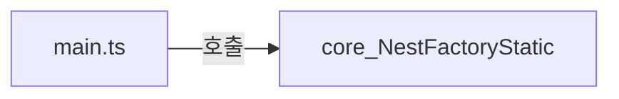

https://app.diagrams.net/#G1WKcmjn527qLntCL6Y-t99qy_zFldV_wU#%7B%22pageId%22%3A%22nr4tStIwETOUoV4FrBBQ%22%7D


```ts  
import { ValidationPipe } from '@nestjs/common';  
import { NestFactory } from '@nestjs/core';  
import { AppModule } from './app.module';  
  
async function bootstrap() {  
  const app = await NestFactory.create(AppModule);  
  app.useGlobalPipes(new ValidationPipe());  
  await app.listen(3000);  
  console.log(`Application is running on: ${await app.getUrl()}`);
}  
bootstrap();  
```  





```ts  
export class NestFactoryStatic {  
	.
	.
	.
}
export const NestFactory = new NestFactoryStatic();
```


## Create

```ts
/**
 * Creates an instance of NestApplication.
 *
 * @param module Entry (root) application module class
 * @param options List of options to initialize NestApplication
 *
 * @returns A promise that, when resolved,
 * contains a reference to the NestApplication instance.
 */
public async create<T extends INestApplication = INestApplication>(
  module: any,
  options?: NestApplicationOptions,
): Promise<T>;
/**
 * Creates an instance of NestApplication with the specified `httpAdapter`.
 *
 * @param module Entry (root) application module class
 * @param httpAdapter Adapter to proxy the request/response cycle to
 *    the underlying HTTP server
 * @param options List of options to initialize NestApplication
 *
 * @returns A promise that, when resolved,
 * contains a reference to the NestApplication instance.
 */
public async create<T extends INestApplication = INestApplication>(
  module: any,
  httpAdapter: AbstractHttpAdapter,
  options?: NestApplicationOptions,
): Promise<T>;


public async create<T extends INestApplication = INestApplication>(
  moduleCls: any,
  serverOrOptions?: AbstractHttpAdapter | NestApplicationOptions,
  options?: NestApplicationOptions,
): Promise<T> {
  const [httpServer, appOptions] = this.isHttpServer(serverOrOptions)
    ? [serverOrOptions, options]
    : [this.createHttpAdapter(), serverOrOptions];

  const applicationConfig = new ApplicationConfig();
  const container = new NestContainer(applicationConfig);
  const graphInspector = this.createGraphInspector(appOptions, container);

  this.setAbortOnError(serverOrOptions, options);
  this.registerLoggerConfiguration(appOptions);

  await this.initialize(
    moduleCls,
    container,
    graphInspector,
    applicationConfig,
    appOptions,
    httpServer,
  );

  const instance = new NestApplication(
    container,
    httpServer,
    applicationConfig,
    graphInspector,
    appOptions,
  );
  const target = this.createNestInstance(instance);
  return this.createAdapterProxy<T>(target, httpServer);
}
```